# ConfigSync

[](https://github.com/dotbrains/configsync/actions?query=workflow%3ATest)
[](https://github.com/dotbrains/configsync/actions?query=workflow%3ABuild)
[](https://github.com/dotbrains/configsync/actions?query=workflow%3ARelease)
[](https://goreportcard.com/report/github.com/dotbrains/configsync)
[](https://opensource.org/licenses/MIT)

A command-line tool for managing macOS application settings and configurations with centralized storage and syncing across multiple Mac systems.

## Overview

ConfigSync helps you maintain consistent application configurations across multiple Mac systems by:
- Storing app configurations in a central location
- Using symlinks to sync settings between the central store and app locations
- Providing easy deployment to new Mac systems
- Creating backups before making changes
- Supporting version control integration

## Architecture

### System Overview


### Core Components

1. **Central Storage**: A directory structure that mirrors common macOS config locations
2. **Configuration Registry**: YAML file tracking managed applications and their settings
3. **Symlink Manager**: Handles safe creation/removal of symlinks with integrity checks
4. **Backup System**: Creates, validates, and manages backups with checksum verification
5. **Deployment Engine**: Syncs configurations to new systems with conflict detection
6. **App Detection Engine**: Multi-method application discovery with smart caching
7. **CLI Interface**: Comprehensive command-line interface with shell completion
8. **Testing Framework**: Extensive test coverage ensuring system reliability

### Directory Structure


**Text representation:**
```
~/.configsync/
├── config.yaml              # Main configuration registry
├── store/                   # Central storage with symlink targets
│   ├── Library/
│   │   ├── Preferences/     # macOS preference files
│   │   └── Application Support/  # App support data
│   ├── Containers/          # Sandboxed app configs
│   ├── Group Containers/    # Shared app data
│   └── .config/            # XDG-style configs
├── backups/                # Versioned snapshots with checksums
│   ├── 2024-01-15-14-30-45/ # Timestamped backup
│   └── checksums.yaml      # Hash validation data
├── logs/                   # Detailed operation history
│   ├── configsync.log      # Main operation log
│   └── sync-2024-01-15.log # Daily sync details
└── temp/                   # Deployment staging area
    ├── export-staging/     # Bundle preparation
    └── import-staging/     # Deployment validation
```

## Commands

### Core Commands

- `configsync init` - Initialize ConfigSync in the current user directory
- `configsync add <app>` - Add an application's configuration to management
- `configsync remove <app>` - Remove an application from management and restore originals
- `configsync sync` - Sync all configurations (create/update symlinks)
- `configsync status` - Show detailed status of all managed configurations

### Backup & Restore Commands

- `configsync backup [app1] [app2]` - Create backups of configurations (all apps if none specified)
- `configsync backup --validate` - Validate integrity of existing backups
- `configsync backup --keep-days 30` - Clean up backups older than specified days
- `configsync restore <app>` - Restore original configuration from backup
- `configsync restore --all` - Restore all applications with backups

### Smart Discovery

- `configsync discover` - Automatically discover installed applications and their configurations
- `configsync discover --list` - List all discovered applications in tabular format
- `configsync discover --auto-add` - Automatically add all discovered apps to configuration
- `configsync discover --filter="app1,app2"` - Filter discovery results to specific applications

### Deployment Commands

- `configsync export` - Export configuration bundle for deployment
- `configsync export --output my-config.tar.gz` - Export to specific file
- `configsync export --apps vscode,git` - Export only specific applications
- `configsync import <bundle>` - Import configuration bundle from another system
- `configsync import --force <bundle>` - Force import even with conflicts
- `configsync deploy` - Deploy imported configurations to current system
- `configsync deploy --force` - Force deployment overriding conflicts

### Utility Commands

- `configsync completion bash` - Generate bash shell completion script
- `configsync completion zsh` - Generate zsh shell completion script
- `configsync completion fish` - Generate fish shell completion script
- `configsync help [command]` - Show help for any command

## Workflow Diagrams

### Sync Process Flow


### Command Usage Flow


## Usage Examples

### Basic Setup

```bash
# Initialize ConfigSync
configsync init

# Discover installed applications automatically
configsync discover

# Auto-add all discovered applications
configsync discover --auto-add

# Or add specific apps manually
configsync add vscode
configsync add "Google Chrome" Firefox Terminal

# Check status
configsync status

# Sync all configurations
configsync sync
```

### Smart Discovery Examples

```bash
# Discover and list all applications with configurations
configsync discover --list

# Discover applications with verbose output to see configuration paths
configsync discover --list --verbose

# Filter discovery to specific applications
configsync discover --filter="chrome,bartender,rectangle"

# Preview what would be added without actually adding
configsync discover --auto-add --dry-run

# Auto-add only applications matching a filter
configsync discover --filter="vscode,slack" --auto-add
```

### Backup & Validation Examples

```bash
# Create backups for specific applications
configsync backup vscode chrome

# Validate all existing backups
configsync backup --validate

# Clean up old backups (older than 30 days)
configsync backup --keep-days 30

# Restore from backup
configsync restore vscode
configsync restore --all  # Restore all apps with backups
```

### Deployment Examples

```bash
# Export all configurations for deployment
configsync export --output ~/Desktop/my-configs.tar.gz

# Export only specific applications
configsync export --output ~/Desktop/dev-tools.tar.gz --apps "vscode,git,ssh"

# Import and deploy on new Mac
configsync init
configsync import ~/Desktop/my-configs.tar.gz
configsync deploy

# Force deployment even with conflicts
configsync deploy --force
```

### Shell Completion Setup

```bash
# Bash completion
configsync completion bash > /usr/local/etc/bash_completion.d/configsync

# Zsh completion (oh-my-zsh)
mkdir -p ~/.oh-my-zsh/completions
configsync completion zsh > ~/.oh-my-zsh/completions/_configsync

# Fish completion
configsync completion fish > ~/.config/fish/completions/configsync.fish
```

### Deployment Workflow

```mermaid
sequenceDiagram
    participant U1 as User (Mac 1)
    participant CS1 as ConfigSync (Mac 1)
    participant Bundle as Config Bundle
    participant U2 as User (Mac 2)
    participant CS2 as ConfigSync (Mac 2)
    participant Apps as Applications (Mac 2)

    Note over U1, CS1: Source System - Export Phase
    U1->>CS1: configsync export [--apps vscode,git]
    CS1->>CS1: 🔍 Validate configurations
    CS1->>CS1: 📊 Calculate checksums
    CS1->>CS1: 📦 Package store/ directory
    CS1->>CS1: 📝 Include config.yaml + metadata
    CS1->>CS1: 🗜️ Create temp/export-staging/
    CS1->>Bundle: Create .tar.gz bundle
    CS1-->>U1: ✅ Export complete with validation

    Note over Bundle: Secure Transfer
    Bundle-->>U2: 🔐 Copy bundle file

    Note over U2, Apps: Target System - Import & Deploy
    U2->>CS2: configsync init
    CS2->>CS2: 🏗️ Create ~/.configsync/ structure
    CS2->>CS2: 📁 Initialize logs/, temp/, backups/

    U2->>CS2: configsync import bundle.tar.gz
    CS2->>Bundle: 📥 Extract to temp/import-staging/
    CS2->>CS2: ✅ Validate bundle integrity
    CS2->>CS2: 🔍 Check for conflicts
    alt Conflicts Detected
        CS2-->>U2: ⚠️ Conflicts found - use --force or resolve
    else No Conflicts
        CS2->>CS2: 📂 Copy configs to store/
        CS2->>CS2: 📋 Update config.yaml
        CS2-->>U2: ✅ Import successful
    end

    U2->>CS2: configsync deploy [--force]
    CS2->>CS2: 🔍 Check target application paths
    CS2->>CS2: 📊 Detect installation differences
    CS2->>CS2: 💾 Create timestamped backups
    CS2->>CS2: 🔐 Generate backup checksums
    CS2->>Apps: 🔗 Create validated symlinks
    CS2->>CS2: 📝 Update sync status & logs
    CS2->>CS2: 🧹 Clean up temp/import-staging/

    CS2-->>U2: ✅ Deployment complete with integrity checks

    rect rgb(240, 248, 255)
        Note over CS1: Enhanced Export:<br/>• Selective app filtering<br/>• Checksum validation<br/>• Staged preparation
    end

    rect rgb(255, 248, 240)
        Note over Bundle: Security Features:<br/>• Bundle integrity checks<br/>• Metadata validation<br/>• Conflict detection
    end

    rect rgb(248, 255, 248)
        Note over CS2: Safe Deployment:<br/>• Automatic backups<br/>• Symlink validation<br/>• Rollback capability<br/>• Operation logging
    end
```



## Supported Applications

ConfigSync supports a wide range of macOS applications through multiple detection methods:

### Built-in Application Support

ConfigSync includes pre-configured support for popular applications:

**Productivity & Development:**
- Visual Studio Code (settings, keybindings, snippets)
- Sublime Text (user packages and settings)
- iTerm2 (terminal preferences)
- Terminal (macOS Terminal settings)
- Git (global configuration and gitignore)
- SSH (SSH client configuration)
- Homebrew (shell integration and configuration)

**Browsers:**
- Google Chrome (preferences and user data)
- Firefox (profiles and preferences)

**Window Management & Utilities:**
- Bartender 4 (menu bar management)
- Rectangle (window management)
- Magnet (window snapping)
- Alfred (launcher and workflow configuration)
- CleanMyMac X (system maintenance)

**Password Managers & Security:**
- 1Password 7 (Password Manager)
- 1Password 8 (latest version)

**Communication & Media:**
- Slack (workspace and preferences)
- Discord (chat client settings)
- Spotify (music streaming preferences)

**System Applications:**
- Finder (file manager preferences)
- Dock (dock configuration and positioning)

### Smart Auto-Discovery

ConfigSync can automatically detect any macOS application using multiple scanning methods:

1. **System Profiler**: Uses macOS `system_profiler` to scan installed applications
2. **Spotlight Search**: Uses `mdfind` to locate .app bundles system-wide
3. **Directory Scanning**: Scans common installation directories:
   - `/Applications`
   - `~/Applications`
   - `/System/Applications`
   - `/System/Library/CoreServices`

4. **Smart Pattern Detection**: Automatically detects configuration files in:
   - `~/Library/Preferences/` - Preference files (.plist)
   - `~/Library/Application Support/` - Application support files
   - `~/Library/Containers/` - Sandboxed app containers
   - `~/Library/Group Containers/` - Shared app containers
   - `~/.config/` - XDG configuration directories
   - `~/.{appname}*` - Dotfiles for CLI applications

### Adding Custom Applications

For applications not automatically detected, you can:
- Use `configsync add <app-name>` with custom paths
- Configure custom paths in the YAML configuration
- Submit a pull request to add built-in support

## Installation

### Homebrew (Recommended)
```bash
# Add the tap and install
brew install dotbrains/tap/configsync

# Verify installation
configsync --version
```

### From Release

#### Universal Binary (Intel + Apple Silicon)
```bash
# Download and install universal binary
curl -L https://github.com/dotbrains/configsync/releases/latest/download/configsync-darwin-universal.tar.gz | tar -xz
sudo mv configsync-darwin-universal /usr/local/bin/configsync
chmod +x /usr/local/bin/configsync
```

#### Architecture-Specific
```bash
# For Intel Macs
curl -L https://github.com/dotbrains/configsync/releases/latest/download/configsync-darwin-amd64.tar.gz | tar -xz
sudo mv configsync-darwin-amd64 /usr/local/bin/configsync

# For Apple Silicon Macs
curl -L https://github.com/dotbrains/configsync/releases/latest/download/configsync-darwin-arm64.tar.gz | tar -xz
sudo mv configsync-darwin-arm64 /usr/local/bin/configsync
```

### From Source
```bash
# Install from source (requires Go 1.21+)
go install github.com/dotbrains/configsync@latest

# Or build locally
git clone https://github.com/dotbrains/configsync.git
cd configsync
make build
sudo cp configsync /usr/local/bin/
```

## Testing & Quality Assurance

ConfigSync maintains high code quality with comprehensive test coverage:

- **75%+ Test Coverage**: Extensive test suites across all core modules
- **Integration Tests**: Full workflow testing including CLI commands
- **Unit Tests**: Individual component testing with mocked dependencies
- **Benchmark Tests**: Performance testing for critical operations
- **Cross-platform Testing**: Verified on Intel and Apple Silicon Macs

### Test Coverage by Module:
- **Backup System**: 75.3% coverage
- **Configuration Manager**: 74.7% coverage
- **Deployment Engine**: 77.7% coverage
- **Symlink Manager**: 74.5% coverage
- **Utilities**: 100% coverage
- **App Detection**: 67.4% coverage
- **CLI Commands**: Structure and integration tested

## Safety Features

- **Automatic Backups**: Creates backups before making any changes
- **Backup Validation**: Verify backup integrity with checksums and size validation
- **Conflict Detection**: Detects and reports configuration conflicts during deployment
- **Dry Run Mode**: Preview changes before applying them (`--dry-run`)
- **Rollback Support**: Easy restoration of original configurations
- **Symlink Validation**: Verifies symlink integrity before operations
- **Smart Discovery Cache**: Caches application scans to improve performance (5-minute cache)
- **Non-Destructive Discovery**: Discovery mode only scans and reports, never modifies files
- **Comprehensive Logging**: Detailed operation logs for troubleshooting

## Documentation

ConfigSync has comprehensive documentation available at **[dotbrains.github.io/configsync](https://dotbrains.github.io/configsync/)**

### Available Documentation

- **[Installation Guide](https://dotbrains.github.io/configsync/installation/)** - Complete installation instructions for all methods
- **[Getting Started](https://dotbrains.github.io/configsync/getting-started/)** - Step-by-step tutorial for new users
- **[CLI Reference](https://dotbrains.github.io/configsync/cli-reference/)** - Complete command-line documentation
- **[Contributing Guide](https://dotbrains.github.io/configsync/contributing/)** - How to contribute to the project
- **[Documentation Hub](https://dotbrains.github.io/configsync/docs/)** - Organized access to all documentation

The documentation site features:
- **Professional Design** - Modern, responsive layout that works on all devices
- **Interactive Examples** - Code blocks with syntax highlighting and copy-to-clipboard
- **Comprehensive Coverage** - Installation, usage, CLI reference, and contribution guidelines
- **Mobile Friendly** - Optimized for reading on phones and tablets
- **Search Friendly** - SEO optimized for better discoverability

### Local Documentation Development

The documentation is built using Jekyll and can be run locally for development:

#### Prerequisites
- **Ruby 2.6+** (macOS includes Ruby by default)
- **Bundler** (`gem install bundler` if not installed)

#### Setup and Running
```bash
# Navigate to documentation directory
cd docs

# Install Jekyll and dependencies
bundle install

# Start local development server with proper baseurl configuration
./dev_server.sh
# OR run manually:
bundle exec jekyll serve --incremental --config _config.yml,_config_dev.yml --port 4000

# View site at: http://localhost:4000/ (CSS and assets will load correctly)
```

#### Development Workflow
- **Live Reload**: Changes are automatically rebuilt and visible after browser refresh
- **Incremental Builds**: Only changed files are rebuilt for faster development
- **Local Testing**: Test all features including navigation, code highlighting, and responsive design
- **Dual Configuration**: Uses both `_config.yml` and `_config_dev.yml` for proper local development
- **Asset Loading**: CSS and JavaScript files load correctly in local development environment

#### Useful Development Commands
```bash
# Start development server (recommended)
./dev_server.sh

# Start development server manually with proper config
bundle exec jekyll serve --incremental --config _config.yml,_config_dev.yml --port 4000

# Start production-style server (for testing GitHub Pages behavior)
bundle exec jekyll serve --incremental --port 4000
# Then visit: http://localhost:4000/configsync/

# Build without serving (for testing)
bundle exec jekyll build

# Clean build files
bundle exec jekyll clean

# Build with development config
bundle exec jekyll build --config _config.yml,_config_dev.yml
```

#### Documentation Structure
```
docs/
├── _config.yml              # Jekyll configuration (production)
├── _config_dev.yml          # Development configuration (local)
├── dev_server.sh            # Development server script
├── favicon.ico              # Site favicon
├── .gitignore               # Git ignore rules
├── _layouts/
│   └── default.html         # Main page template
├── _includes/
│   ├── header.html          # Navigation header
│   └── footer.html          # Site footer
├── assets/
│   ├── css/style.css        # Custom styling
│   ├── js/main.js          # Interactive features
│   └── images/
│       └── logo.svg         # Site logo
├── index.html               # Homepage
├── installation.md          # Installation guide
├── getting-started.md       # Tutorial
├── cli-reference.md         # CLI documentation
├── contributing.md          # Contribution guide
├── docs.md                  # Documentation hub
└── Gemfile                  # Jekyll dependencies
```

#### Jekyll Configuration Details

The documentation uses a dual-configuration approach to handle the GitHub Pages `baseurl` requirement while maintaining a smooth local development experience:

**Production Configuration (`_config.yml`)**:
- `baseurl: "/configsync"` - Required for GitHub Pages deployment
- Site served at `https://dotbrains.github.io/configsync/`
- Assets referenced with `/configsync/` prefix

**Development Configuration (`_config_dev.yml`)**:
- `baseurl: ""` - Empty baseurl for local development
- Site served at `http://localhost:4000/`
- Assets referenced without prefix for proper loading

**Template Logic (`_layouts/default.html`)**:
The layout template includes conditional logic to handle both environments:
```liquid

<link rel="stylesheet" href="/assets/css/style.css?v={{ site.github.build_revision }}">

<link rel="stylesheet" href="{{ '/assets/css/style.css?v=' | append: site.github.build_revision | relative_url }}">

```

This ensures CSS and JavaScript files load correctly in both local development and production deployment.

#### Contributing to Documentation
- **Edit Markdown files** in the `docs/` directory
- **Test locally** using `./dev_server.sh` before submitting pull requests
- **Follow style guide** for consistency
- **Update navigation** in `_config.yml` if adding new pages
- **Test both environments**: Local development and production-style serving

#### Troubleshooting Documentation Development

**CSS/JS Not Loading in Local Development:**
```bash
# Ensure you're using the development configuration
./dev_server.sh
# OR
bundle exec jekyll serve --config _config.yml,_config_dev.yml

# Visit: http://localhost:4000/ (NOT /configsync/)
```

**Jekyll Address Already in Use Error:**
```bash
# Kill existing Jekyll processes
lsof -ti:4000 | xargs kill -9

# Restart the server
./dev_server.sh
```

**Missing Dependencies:**
```bash
# Reinstall Jekyll dependencies
bundle install

# If Ruby/Bundler issues:
gem install bundler
bundle install
```

**Asset 404 Errors:**
- Check that `favicon.ico` exists in the `docs/` directory
- Verify `assets/images/logo.svg` exists
- Ensure you're using the development server script

#### GitHub Pages Deployment
The documentation automatically deploys to GitHub Pages when changes are pushed to the main branch:
1. **Push changes** to the main branch
2. **GitHub Actions** builds the Jekyll site
3. **Site updates** at [dotbrains.github.io/configsync](https://dotbrains.github.io/configsync/)
4. **Monitor deployment** in the repository's Actions tab

### Documentation Feedback
Found an issue with the documentation?
- **Report bugs** via [GitHub Issues](https://github.com/dotbrains/configsync/issues)
- **Suggest improvements** via [GitHub Discussions](https://github.com/dotbrains/configsync/discussions)
- **Submit fixes** via pull requests

## Contributing

Contributions are welcome! Please see our [contribution guidelines](CONTRIBUTING.md) for details.

For information about the release process, see the [release documentation](RELEASE.md).

### Development Setup

#### Prerequisites

Before you can build and develop ConfigSync, ensure you have the following tools installed:

**Required:**
- **Go 1.21+** - [Download from golang.org](https://golang.org/downloads/) or install via Homebrew:
  ```bash
  brew install go
  ```
- **golangci-lint v2.x** - Required for `make lint` to work:
  ```bash
  # macOS (Homebrew - recommended)
  brew install golangci-lint

  # Or install directly
  curl -sSfL https://raw.githubusercontent.com/golangci/golangci-lint/master/install.sh | sh -s -- -b $(go env GOPATH)/bin
  ```

**Recommended:**
- **goimports** - For import formatting (required for pre-commit hooks):
  ```bash
  go install golang.org/x/tools/cmd/goimports@latest
  ```
- **pre-commit** - For automated code quality checks (see Code Quality section below):
  ```bash
  brew install pre-commit
  ```

#### Quick Setup

```bash
# Clone the repository
git clone https://github.com/dotbrains/configsync.git
cd configsync

# Install Go dependencies
go mod download

# Install required development tools (macOS with Homebrew)
brew install golangci-lint
go install golang.org/x/tools/cmd/goimports@latest

# Verify tools are installed correctly
go version          # Should show Go 1.21+
golangci-lint --version  # Should show golangci-lint version
goimports --help    # Should show goimports usage

# Run tests to verify setup
make test

# Build the project
make build

# Run linter (should pass with 0 issues)
make lint

# Optional: Set up pre-commit hooks for automated quality checks
brew install pre-commit
pre-commit install
```

#### Available Make Commands

```bash
# Core development commands
make build         # Build the binary
make test          # Run all tests
make lint          # Run linter (requires golangci-lint)
make fmt           # Format code
make clean         # Clean build artifacts

# Advanced commands
make build-all     # Build for multiple platforms
make test-coverage # Run tests with coverage report
make install       # Install to /usr/local/bin
make tidy          # Clean up go.mod
make help          # Show all available commands
```

#### Troubleshooting Development Setup

**"golangci-lint: command not found" when running `make lint`:**
```bash
# Install golangci-lint
brew install golangci-lint
# Or check if it's in your PATH
echo $PATH
which golangci-lint
```

**"goimports: executable file not found" during pre-commit:**
```bash
# Install goimports
go install golang.org/x/tools/cmd/goimports@latest
# Ensure GOPATH/bin is in your PATH
echo 'export PATH=$PATH:$(go env GOPATH)/bin' >> ~/.zshrc  # or ~/.bashrc
source ~/.zshrc
```

**Go modules issues:**
```bash
# Clean and re-download dependencies
go clean -modcache
go mod download
go mod tidy
```

**Build failures:**
```bash
# Verify Go version (must be 1.21+)
go version

# Clean and rebuild
make clean
make build
```

#### Verifying Your Development Setup

After setting up the development environment, run these commands to ensure everything is working:

```bash
# 1. Verify all required tools are installed
go version                    # Should show Go 1.21 or higher
golangci-lint --version      # Should show golangci-lint version
goimports --help >/dev/null && echo "goimports: ✓" || echo "goimports: ✗"

# 2. Test the build process
make clean
make build
./configsync --version       # Should show the version

# 3. Run the test suite
make test                    # Should pass all tests

# 4. Run the linter
make lint                    # Should show "0 issues."

# 5. Test pre-commit hooks (if installed)
pre-commit run --all-files  # Should pass all checks

# If all commands above succeed, your development setup is ready! ✅
```

**Expected output for a successful setup:**
```
$ go version
go version go1.21.0 darwin/arm64

$ golangci-lint --version
golangci-lint has version 1.54.2 built from abc123 on 2023-08-07

$ make build
go build -o configsync ./cmd/configsync

$ ./configsync --version
configsync version v1.0.5

$ make test
?       github.com/dotbrains/configsync/cmd/configsync      [no test files]
ok      github.com/dotbrains/configsync/internal/backup     0.123s
...

$ make lint
golangci-lint run
0 issues.
```

### Code Quality & Pre-commit Hooks

ConfigSync uses automated code quality tools to maintain high standards. We use pre-commit hooks to catch issues early in the development process.

#### Setting up Pre-commit Hooks

```bash
# Install pre-commit (macOS)
brew install pre-commit

# Install the pre-commit hooks
pre-commit install

# Install goimports for import formatting
go install golang.org/x/tools/cmd/goimports@latest
```

#### Pre-commit Hook Features

The pre-commit configuration automatically:
- **Formats code**: Runs `gofmt` and `goimports` to ensure consistent formatting
- **Cleans whitespace**: Removes trailing whitespace and ensures files end with newlines
- **Validates YAML**: Checks YAML files for syntax errors
- **Runs linting**: Performs golangci-lint checks (non-blocking for development flow)
- **Prevents large files**: Blocks accidentally committed large files
- **Checks merge conflicts**: Prevents committing files with merge conflict markers

#### Manual Hook Execution

```bash
# Run pre-commit hooks on all files
pre-commit run --all-files

# Run pre-commit hooks on staged files only
pre-commit run

# Update hook versions
pre-commit autoupdate
```

#### Linting

```bash
# Run golangci-lint manually
golangci-lint run --timeout=5m

# Run with specific linters only
golangci-lint run --enable=errcheck,govet,gofmt

# Run go vet (always passes)
go vet ./...
```

### Running Tests

```bash
# Run all tests
go test ./...

# Run tests with coverage
make test-coverage

# Run specific package tests
go test ./internal/config -v

# Run tests with race detection
go test -race ./...
```

### Adding Support for New Applications

ConfigSync makes it easy to add support for new applications:

#### Method 1: Using Smart Discovery (Recommended)
1. Install the application you want to add support for
2. Run `configsync discover --filter="appname"` to see if it's auto-detected
3. If detected, run `configsync discover --filter="appname" --auto-add` to add it
4. If you want to contribute built-in support, see Method 2

#### Method 2: Adding Built-in Support
1. Add the application configuration to `pkg/apps/detector.go` in the `knownApps` map
2. Include the correct bundle ID and configuration paths
3. Test using `configsync discover --filter="appname" --list --verbose`
4. Add tests for the new application
5. Update documentation in README.md
6. Submit a pull request

Example addition to `knownApps`:
```go
"newapp": {
    Name:        "newapp",
    DisplayName: "New Application",
    BundleID:    "com.company.newapp",
    Paths: []PathInfo{
        {
            Source:      "~/Library/Preferences/com.company.newapp.plist",
            Destination: "Library/Preferences/com.company.newapp.plist",
            Type:        config.PathTypeFile,
            Required:    false,
        },
    },
},
```

## License

This project is licensed under the MIT License - see the [LICENSE](LICENSE) file for details.
